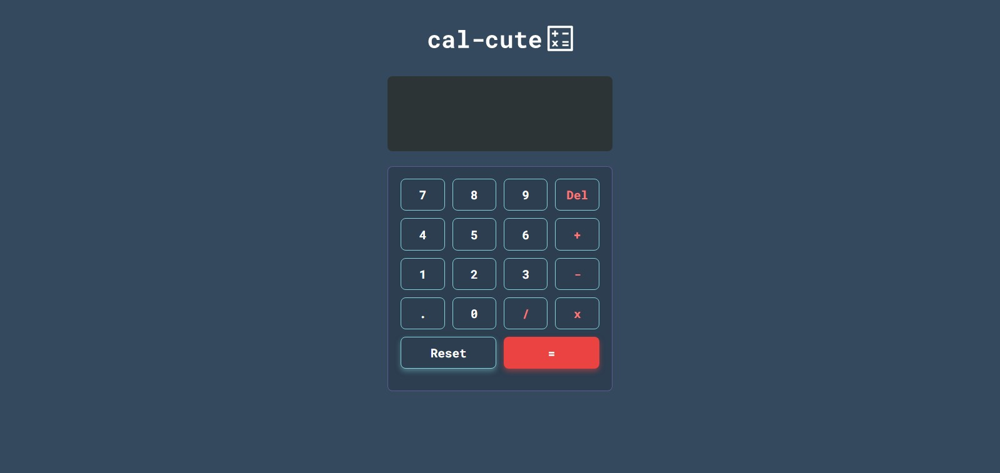

# Cal-cute, a simple calculator built with HTML, SASS, and JavaScript

## Table of contents

- [Overview](#overview)
  - [Screenshot](#screenshot)
  - [Links](#links)
- [My process](#my-process)
  - [Built with](#built-with)
  - [Useful resources](#useful-resources)
- [Author](#author)

## Overview

### Screenshot

### Links

- Live Site URL: [Add live site URL here](https://your-live-site-url.com)

## My process

### Built with

- Semantic HTML5 markup
- CSS custom properties
- CSS Grid
- SASS
- Mobile-first workflow
- JavaScript

### Useful resources

- [Youtube: Web Dev Simplified](https://youtu.be/j59qQ7YWLxw) - Thanks to Web Dev Simplified, i can solved my problems on the JavaScript code.

## Author

- Twitter - [@zabamz1](https://www.twitter.com/zabamz1)
- Instagram - [@zfaabam](https://www.instagram.com/zfaabam)
